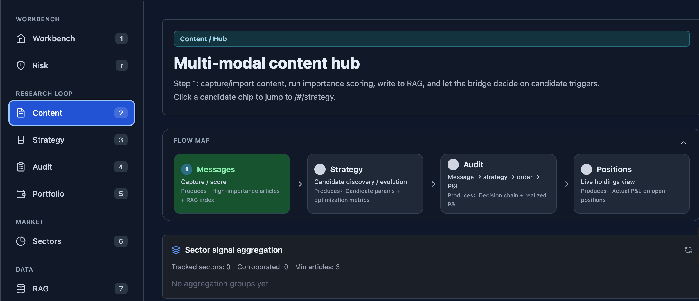
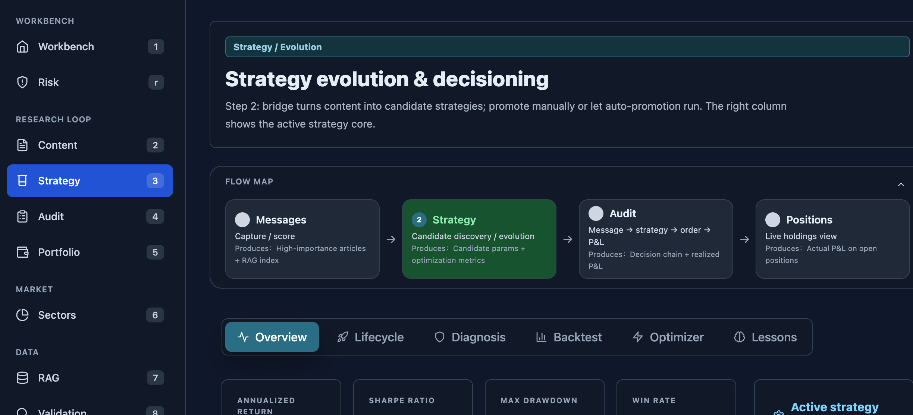
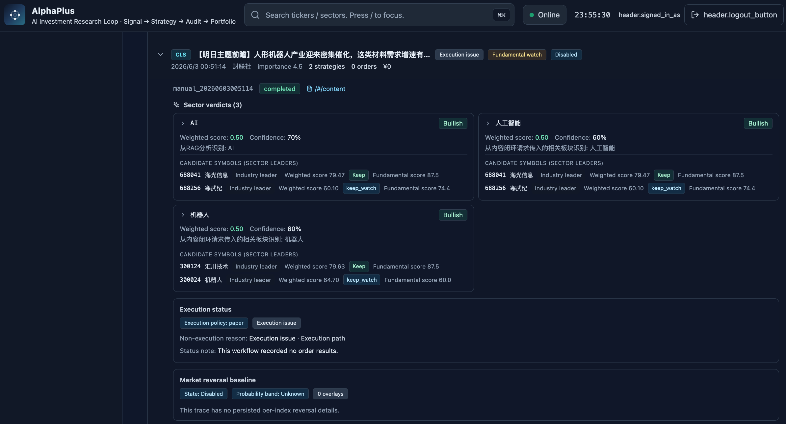

# AlphaPlus Edge

**本机敏感数据桥接 · 云端投研编排**

> 浏览器 Cookie、小红书登录态、个人微信本地库 —— 留在你的设备上。  
> RAG、Agent、行情与 Workflow —— 在云端 Neura Gateway 执行。

[](LICENSE)

---

## 一句话价值主张

**「敏感面在 Edge，算力在 Cloud」** —— 用 MCP + WSS 隧道，把 OpenCLI / wx-cli 能力安全接到 AlphaPlus 投研控制台，无需把 Chrome 登录态或微信 DB 上传到服务器。

## 适用谁

| 用户 | 场景 |
|------|------|
| 投研个人 / 小团队 | 小红书、公众号、个人微信线索采集 → 云端 RAG |
| AI / 数据工程师 | 本地 MCP 聚合端口，Cursor / NeuraDesk 直连 Edge |
| 量化 / 卖方研究 | 跨平台内容进 Cloud closed-loop，Edge 只出 L2 摘要 |

## 30 秒快速开始

**前置：** Python 3.10+、可选 OpenCLI + wx-cli、已运行的 [Neura Gateway](https://github.com/lqjack/dataproaiset)（`:8001`）

```bash
git clone https://github.com/lqjack/alphaplus-edge.git
cd alphaplus-edge

# 从 monorepo 同步运行时（开发期；发布版 bundle 已内置）
bash scripts/sync-from-monorepo.sh ../dataproaiset   # 可选

cp .env.example .env.edge
# 编辑 CLOUD_GATEWAY_URL、EDGE_DEVICE_TOKEN

bash scripts/edge/start-edge-stack.sh
bash scripts/edge/edge-doctor.sh
```

**健康检查：** `curl -s http://127.0.0.1:10490/health | jq`

**macOS 桌面版：** 见 [edge-desktop/README.md](edge-desktop/README.md)（Tauri 一键 Tunnel + 注册）

## 架构一览

```text
┌──────────────────── 用户设备（Edge） ────────────────────┐
│  Edge Agent (:10490)                                      │
│    ├─ xiaohongshu MCP   :10350  (OpenCLI + Chrome)       │
│    ├─ wx_cli MCP        :10475  (本地微信 DB，只读)       │
│    ├─ opencli_weixin    :10485  (公众号浏览器)            │
│    └─ WSS Tunnel ──────────────────────────────┐         │
└────────────────────────────────────────────────│─────────┘
                                                 │ HTTPS/WSS
                                                 ▼
┌──────────────────── 云端（Cloud） ───────────────────────┐
│  Neura Gateway :8001                                    │
│    POST /api/tools/call  →  路由到 Edge 或 Cloud MCP      │
│    POST /api/edge/devices/register                      │
│  stock / skills_api / RAG / market …                    │
└─────────────────────────────────────────────────────────┘
```

详细设计：[docs/ARCHITECTURE.md](docs/ARCHITECTURE.md)

## Cloud 闭环预览（财联社 Demo）

演示环境：[alphaplus.datapro.asia](https://alphaplus.datapro.asia) — 默认 **CLS 财联社** 数据源，内容 → 策略 → 复盘全链可审计。

| Step | 截图 | 说明 |
|------|------|------|
| 1 · 内容中枢 |  | 消息采集 / 重要性评分 / RAG 索引 |
| 2 · 策略演化 |  | 候选发现与优化指标 |
| 3 · 复盘决策链 |  | 财联社快讯 → 板块判定 → 标的候选 |

更多截图说明：[assets/screenshots/README.md](assets/screenshots/README.md)

## Demo

| 类型 | 文档 / 命令 |
|------|-------------|
| CLI 5 分钟闭环 | [docs/DEMO.md](docs/DEMO.md) § Quickstart |
| Gateway→Edge→MCP LIVE | `bash scripts/edge/live-edge-gateway-tool-e2e.sh` |
| 小红书 → RAG 全链 | `bash scripts/edge/live-edge-xhs-rag-e2e.sh` |
| macOS 安装包验证 | `bash scripts/edge/verify-edge-macos.sh` |

## 与 dataproaiset monorepo 的关系

| 仓库 | 角色 |
|------|------|
| **[alphaplus-edge](https://github.com/lqjack/alphaplus-edge)**（本仓） | 公开：Edge Agent、桌面安装包、本机 MCP、营销与 Demo |
| **[dataproaiset](https://github.com/lqjack/dataproaiset)** | 全栈：Gateway、Stock、Neura Runtime、RAG、Landing |

本仓 **不替代** monorepo 中的 `scripts/edge/` 与 `edge-desktop/` —— 两边并行维护；发布前用 `scripts/sync-from-monorepo.sh` 对齐代码。

## 文档索引

| 文档 | 说明 |
|------|------|
| [docs/LAUNCH_PLAYBOOK.md](docs/LAUNCH_PLAYBOOK.md) | **公开发布 + 90 天营销节奏（执行总纲）** |
| [docs/NARRATIVE.md](docs/NARRATIVE.md) | 内容叙事与品牌话术 |
| [docs/MARKETING_PLAN.md](docs/MARKETING_PLAN.md) | 全渠道推广方案 |
| [docs/DEMO.md](docs/DEMO.md) | 演示脚本与录屏分镜 |
| [docs/CLOUD_INTEGRATION.md](docs/CLOUD_INTEGRATION.md) | 对接云端 Gateway |
| [docs/ASSETS_NEEDED.md](docs/ASSETS_NEEDED.md) | **需你提供的素材清单** |
| [docs/PUBLISH_CHECKLIST.md](docs/PUBLISH_CHECKLIST.md) | 公开发布前检查 |
| [docs/README.md](docs/README.md) | **文档中心（入口）** |
| [assets/screenshots/](assets/screenshots/) | 产品截图（CLS 闭环 Demo，已同步） |
| [docs/delivery/](docs/delivery/) | 各渠道文案模板 |

## 合规声明

本项目输出仅用于研究辅助，不构成投资建议或收益承诺。  
个人微信聊天记录、浏览器 Cookie 等 L0/L1 数据默认不出本机；上传云端仅为用户显式触发的 L2 业务摘要。

## License

Apache License 2.0 — 见 [LICENSE](LICENSE)
